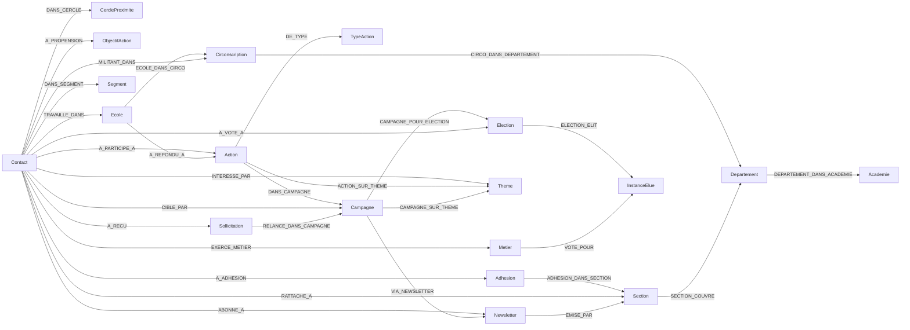

# FSU-SNUipp — Modélisation Neo4j de l'adhésion et de la base électorale

Note de modélisation · juin 2026 · cible : élections professionnelles de décembre 2026. Schéma intégralement en français.

## Objectif

Représenter sous forme de graphe les ~150 000 contacts du syndicat pour **qualifier les électeurs** et **estimer la réserve de voix**, en vue des élections professionnelles de décembre 2026. Le graphe sert de socle commun à la segmentation par proximité, par centres d'intérêt et au scoring.

## Vue d'ensemble

19 nœuds, 31 relations, organisés autour du nœud central **Contact**. Le modèle intègre la cartographie des données (juin 2026) : SNUPers/BigQuery comme socle de jointure, SNUTELLA pour les relances, Brevo pour les newsletters, et l'open data Éducation nationale pour le référentiel territorial.



## Les nœuds et leur rôle

**Contact** — l'entité pivot : un personnel des écoles. Porte le statut d'adhésion courant (`statut_adhesion`), le cycle de carrière, les scores de synthèse (`score_proximite`, `score_engagement`, `score_interet`) et `propension_vote`, la probabilité estimée de voter qui matérialise la réserve de voix. `qualite_donnee` et `consentement_email` servent l'audit de base et le ciblage.

**CercleProximite** — les quatre cercles historiques (section, adherent, sympathisant, contact), en nœud de vocabulaire contrôlé portant le `rang` et le rôle attendu. La relation `DANS_CERCLE` porte le `score` qui a justifié le classement.

**ObjectifAction** — les objectifs d'action issus du kick-off (voter, voter pour l'organisation, adhérer, se mobiliser, relayer, devenir volontaire). La relation `A_PROPENSION {score}` porte une propension *par objectif* : un contact peut être proche pour une action et lointain pour une autre. La proximité n'est donc pas unidimensionnelle — `score_proximite` reste un indicateur de synthèse, mais le pilotage fin se fait sur ces propensions.

**Metier** — le métier (professeur des écoles, AESH, PsyEN, directeur, AED…), enseignant ou non. Pont vers l'électoral : `Metier -[:VOTE_POUR]-> InstanceElue` encode le collège, donc quelle instance chaque métier contribue à élire.

**Adhesion** — une adhésion annuelle (une par année et par contact), en nœud pour conserver l'**historique** : trajectoire adhérent → ancien adhérent, continuité des cotisations, ré-adhésions. Matière première du score de proximité.

**Ecole / Circonscription / Section / Departement / Academie** — la maille territoriale, calquée sur le premier degré : `Ecole → Circonscription → Departement → Academie`. C'est à l'**école** que se concentrent la base adhérente et la réserve de voix : `Ecole.effectif` est le dénominateur le plus fin du potentiel électoral, `nb_adherents` y mesure l'implantation. La `Section` syndicale reste rattachée au département (`SECTION_COUVRE`) : maille d'organisation militante, distincte de la maille administrative.

**Theme** — les centres d'intérêt (conditions de travail, rémunération, inclusion, carte scolaire, carrière, pédagogie…). Reliés au contact (`INTERESSE_PAR`, pondéré), aux actions et aux campagnes : axe de segmentation thématique.

**Action / TypeAction** — une action de mobilisation et son type. La participation (`A_PARTICIPE_A`, datée) alimente le score d'engagement, pondéré par `poids_engagement` du type.

**Campagne** — campagnes email/SMS, source de collecte et vecteur d'exposition. `CIBLE_PAR` trace envoi/ouverture/clic par contact : signal d'engagement comportemental.

**Election / InstanceElue** — le scrutin (2022, décembre 2026) et les instances élues (CSA, CAPN, CAPD, CCP AESH…). `sieges` permet de raisonner sur le nombre d'élus.

**Segment** — les segments stratégiques activables, rattachés via `DANS_SEGMENT`.

**Newsletter** — newsletters nationales (Brevo) et départementales (Brevo départemental, reliées à leur `Section` via `EMISE_PAR`). L'**inscription** (`ABONNE_A`) est distinguée des envois (`CIBLE_PAR` sur la campagne, qui porte ouvert/cliqué/`converti`) : être abonné est un état, ouvrir est un comportement.

**Sollicitation** — les relances enregistrées dans les outils de campagne (SNUTELLA) : appel, SMS, email, avec leur `issue` (décroché, répondeur, déjà voté, refus…). C'est la trace opérationnelle des campagnes d'appels.

## Apports de la cartographie des données (champ par champ)

Le contact est enrichi des champs SNUPers : `id_snupers` (socle de jointure entre univers), `grade`, `anciennete`, `type_affectation` (situation professionnelle), et les clés de rapprochement `telephone` / `date_naissance` avec `methode_rapprochement` (directe ou probabiliste) pour tracer la qualité des jointures. L'`Ecole` reçoit la géolocalisation open data EN ; la `Circonscription` porte `date_maj` et `source` car l'open data peut être en retard sur les redécoupages locaux. La relation `DANS_CERCLE` porte une `version` : les scores et cercles sont des constructions analytiques dont la méthode doit rester documentée (prudence n°3 de la cartographie).

Point structurel important : les **enquêtes carte scolaire et de grève sont répondues à l'échelle de l'école**, pas de l'individu — d'où la relation `Ecole -[:A_REPONDU_A]-> Action`, distincte de `Contact -[:A_PARTICIPE_A]-> Action`. C'est un signal d'implantation locale qui ne doit pas être confondu avec un signal individuel. Enfin, `MILITANT_DANS` capture l'information déclarative des sections (« un militant connu dans cette circonscription »), avec sa `source` — donnée déclarée, à pondérer différemment des données observées.

## Partis pris de modélisation

L'adhésion est un **nœud** (et non une propriété) pour préserver l'historique. Les scores restent des **propriétés** du contact (valeurs courantes recalculées). Cercles, objectifs d'action et types d'action sont des **nœuds de vocabulaire contrôlé**. Le contact est ancré à l'**école** (`TRAVAILLE_DANS`) pour descendre le pilotage jusqu'au niveau où le syndicat agit, tout en gardant le rattachement syndical à la `Section` (`RATTACHE_A`) — deux mailles complémentaires à réconcilier lors de l'audit.

La réserve de voix se lit à deux niveaux : le **potentiel théorique** (effectifs `effectif` agrégés de l'école au département, croisés au collège via `Metier -[:VOTE_POUR]-> InstanceElue`) et le **potentiel mobilisable** (`propension_vote`, dérivé des scores et du vote 2022 via `A_VOTE_A`).

## Requêtes d'analyse électorale clés

Réserve de voix la plus fine — par école (forte propension, non encore adhérents) :

```cypher
MATCH (c:Contact)-[:TRAVAILLE_DANS]->(ec:Ecole)
WHERE c.propension_vote >= 0.6 AND c.statut_adhesion <> 'adherent'
RETURN ec.nom AS ecole, ec.code_uai AS uai, count(c) AS reserve_voix,
       round(avg(c.propension_vote), 2) AS propension_moyenne
ORDER BY reserve_voix DESC;
```

Agrégation de la réserve par circonscription puis département :

```cypher
MATCH (c:Contact)-[:TRAVAILLE_DANS]->(:Ecole)-[:ECOLE_DANS_CIRCO]->(circo:Circonscription)-[:CIRCO_DANS_DEPARTEMENT]->(d:Departement)
WHERE c.propension_vote >= 0.6 AND c.statut_adhesion <> 'adherent'
RETURN d.nom AS departement, circo.nom AS circonscription, count(c) AS reserve_voix
ORDER BY departement, reserve_voix DESC;
```

Réserve de voix par instance élue (via le collège du métier) :

```cypher
MATCH (c:Contact)-[:EXERCE_METIER]->(m:Metier)-[:VOTE_POUR]->(b:InstanceElue)
RETURN b.nom AS instance, b.sieges AS sieges, count(c) AS electeurs_potentiels,
       round(avg(c.propension_vote), 2) AS propension_moyenne
ORDER BY electeurs_potentiels DESC;
```

Propension par objectif d'action — qui activer pour quoi (proximité multidimensionnelle) :

```cypher
MATCH (c:Contact)-[p:A_PROPENSION]->(o:ObjectifAction)
WHERE p.score >= 0.7
RETURN o.nom AS objectif, count(c) AS contacts_activables,
       round(avg(p.score), 2) AS score_moyen
ORDER BY contacts_activables DESC;
```

Anciens adhérents à reconquérir, ciblés par sujet prioritaire :

```cypher
MATCH (c:Contact)-[:INTERESSE_PAR]->(t:Theme {est_prioritaire: true})
WHERE c.statut_adhesion = 'ancien_adherent'
RETURN t.nom AS sujet, count(c) AS anciens_adherents,
       round(avg(c.propension_vote), 2) AS propension_moyenne
ORDER BY anciens_adherents DESC;
```

## Pistes de scoring (à calibrer)

`score_proximite` agrège ancienneté et continuité des adhésions, cercle courant et rattachement section. `score_engagement` somme les participations pondérées par `TypeAction.poids_engagement` et l'engagement email (ouvertures/clics). `score_interet` mesure la densité des liens `INTERESSE_PAR`. Les **propensions par objectif** (`A_PROPENSION.score`) combinent ces signaux différemment selon l'objectif visé. `propension_vote` intègre le vote 2022 (`A_VOTE_A.a_vote`) — variable à valider contre les résultats observés.

## Fichiers livrés

- `fsu_snuipp_modele.mermaid` — diagramme du schéma.
- `fsu_snuipp_modele.arrows.json` — modèle visuel importable sur arrows.app.
- `fsu_snuipp_models.py` — modèles Pydantic (nœuds + relations).
- `fsu_snuipp_ingestion.cypher` — contraintes, données de référence et ingestion paramétrée (`$records`).
- `Note_de_modelisation.md` — ce document.
